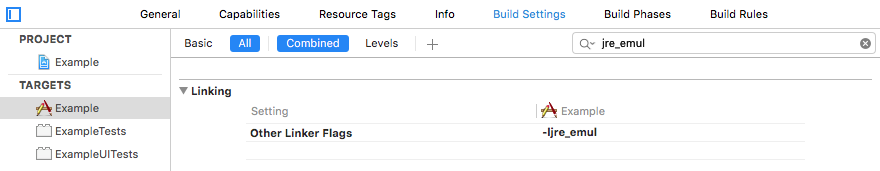
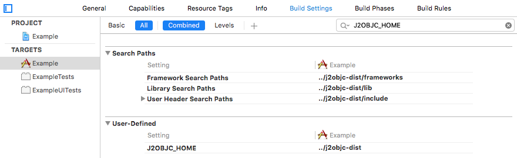
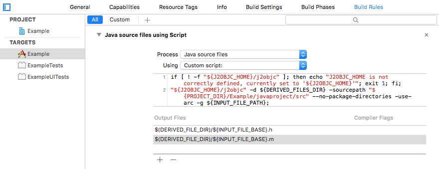

# Xcode Build Rules

Most Xcode project types support build rules, which allow developers to modify
how existing file types are built, and to define how new file types are built.
The J2ObjC scripts are intentionally designed to plug into build systems like Xcode.

>The [j2objc-sample-reversi project](https://github.com/tomball/j2objc-sample-reversi) is
>an example of how to add Java sources to a simple iOS game.

A minimal build requires updating build settings and then adding an J2ObjC build rule.

## Update the Build Settings

1. Click the project in the *Project Navigator* to open the *Project Editor* and ensure the
application target is selected.
1. Click the *Build Settings* tab.
1. Link the JRE emulation library (`jre_emul`) by adding `-ljre_emul` to *Other Linker Flags*.
It should look like this:



1. Click the *+* to and select *Add User-Defined Setting*.
1. Name the setting `J2OBJC_HOME` and set its value to the location of J2ObjC. This should
either be the folder resulting from unzipping the [release zip](https://github.com/google/j2objc/releases)
or the `j2objc/dist` folder if you compiled from source and your root is `j2objc`.
1. Under *Search Paths* modify the following:

  - *Framework Search Paths* add `${J2OBJC_HOME}/frameworks`
  - *Library Search Paths* add `${J2OBJC_HOME}/lib` (for each build configuration).
  - *User Header Search Paths* add `${J2OBJC_HOME}/include`.

1. Confirm your settings by searching for `J2OBJC_HOME`. You should see something similar to this:



## Adding a J2ObjC Build Rule

1. Determine the root directory of your Java source files, which we'll call 
`$source-root`. The root directory is the directory that contains the top
package of your source files. 

  - If you using git and would like to pull in your Java files from another git project, you can add a
  [submodule](https://git-scm.com/docs/git-submodule) tracking the project with your Java sources.
  For example, suppose your Xcode project (xcodeproj) is in `~/dev/MyProject` then you likely have
  another `MyProject` directory with your Objective-C source. In the `~/dev/MyProject/MyProject` directory
  run `git submodule add git@github.com:user/javaproject` to create a `~/dev/MyProject/MyProject/javaproject`
  directory with source for your Java project right along side your Objective-C sources.
  You can then drag that folder into your Xcode project under the `MyProject` group, which has
  Xcode mirroring your filesystem. `${PROJECT_DIR}/MyProject/javaproject/src` is the `$source-root`.

  - If your Java sources are in a group or directory in your Xcode project, the `$source-root`
  is `${PROJECT_DIR}/__group_or_directory_name__`.

  - If in doubt, right click on that group or directory and select Show in Finder
  to see the directory and use the absolute path.

  - For example, if you have a Java package `foo.bar` in a directory called
  `~/myproject/src`, that package's Java files should be in
  `~/myproject/src/foo/bar/**.java` -- that means `~/myproject/src` is the root
  directory for your project.

  - If the Java source files are external to the Xcode project, enter the full path used
  when listing them in a Terminal window.

1. Click the project in the *Project Navigator* to open the *Project Editor* and ensure the
application target is selected.
1. Click the *Build Rules* tab.
1. Click the *+* to add a build rule.
1. For the new rule's *Process* option, select "Java source files". The *Using* option should be "Custom script:".
1. In the custom script text box, add the following (remember to substitute `$source-root`):

```
if [ ! -f "${J2OBJC_HOME}/j2objc" ]; then echo "J2OBJC_HOME is not correctly defined, currently set to '${J2OBJC_HOME}'"; exit 1; fi;
"${J2OBJC_HOME}/j2objc" -d ${DERIVED_FILES_DIR} -sourcepath "$source-root" --no-package-directories -g ${INPUT_FILE_PATH};
```

1. In the Output Files panel, click the *+* button and add: `${DERIVED_FILES_DIR}/${INPUT_FILE_BASE}.h`.
1. Click the *+* button again, and add `${DERIVED_FILES_DIR}/${INPUT_FILE_BASE}.m`.

When you are finished, the settings panel should look something like this:



## Linking Additional Libraries

The link build step (Xcode's "Link Binary With Libraries" build phase) needs
J2ObjC-specific flags, which vary depending on how your application uses translated Java classes.
For a complete list see [Required Link Settings](Required-Link-Flags.html). Here are a couple
examples what additional libraries you may need to link:

- To use the `java.util.zip` package you must link the libz.dylib library by adding
`-ljre_zip` to your *Other Linker Flags*.
- To do secure hash generation, you must add the Security Framework to your project.

## Debugging Build Problems

If Xcode reports a build failure with these steps, open the *Issue Navigator* and
click on an error to inspect the details. This will show the details of what command-line
statement was executed. Here are a few common errors:

- *_Class_ cannot be resolved* - Most likely, the `$source-path` you used was incorrect.
Look for the `-sourcepath` option in the executed command and ensure it points to the
root directory of your Java source files.

- *"JreEmulation.h" file not found* - Most likely, the problem is a bad *User Header Search
Paths* value. Search the build command for the `-I` option with the path; if it looks okay,
copy the path (not the -I) and in a terminal window run `ls` with that path to verify there
isn't a typo.

- *"_IOSClass_FromClass", referenced from:* or *"_OBJC_CLASS_$_Java"* - Either the *Library
Search Paths* is incorrect or you forgot to link the JRE emulation library by setting *Other
Linker Flags* to `-ljre_emul`. You may also need to link additional libraries.

If you still have problems, ask the
[j2objc-discuss group](https://groups.google.com/forum/?hl=en#!forum/j2objc-discuss).
